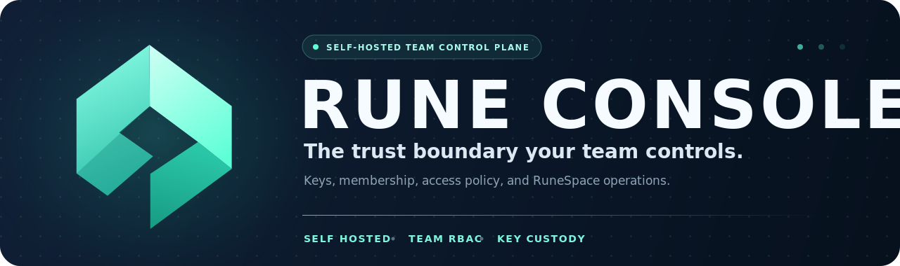

<p align="center">
  <a href="https://rune.team" aria-label="RUNE website">
    
  </a>
</p>

<p align="center">
  
</p>

<p align="center">
  <a href="https://rune.team">rune.team</a> ·
  <a href="https://rune.team/docs">Documentation</a> ·
  <a href="https://github.com/CryptoLabInc/rune-console/releases">Releases</a>
</p>

Rune Console is the self-hosted control plane and cryptographic trust boundary for a RUNE organization. It keeps team keys under the organization's control, applies membership and team policy, manages invitations, and connects authorized agents to their RuneSpace workspace.

The Console includes both the Go daemon and an embedded React management UI. The browser UI binds to loopback by default, while agents connect to the TLS-protected gRPC endpoint advertised in their registration strings.

## What you manage

- **Workspace lifecycle** — provision, connect, stop, start, and delete the organization's RuneSpace workspace.
- **Members and invitations** — invite teammates, resend or cancel invitations, inspect connection state, and deactivate sessions.
- **Teams and access** — build a hierarchical team structure and grant read, write, or edit roles.
- **Key custody** — generate and retain the FHE key sets used to protect stored vectors and decrypt authorized results.
- **Agent onboarding** — issue single-use `runev1_…` registration strings with a pinned Console CA.
- **Auditability** — retain daemon and security-relevant operation logs with local rotation.

## Deployment model

```text
Administrator browser
  │  http://127.0.0.1:8787 (direct or SSH tunnel)
  ▼
Rune Console
  ├─ embedded management UI + session BFF
  ├─ member, invitation, team, and role stores
  ├─ FHE keys and result decryption
  └─ TLS gRPC endpoint for rune-mcp
           │
           ▼
       RuneSpace workspace
```

The management UI is intentionally loopback-only. For a remote installation, the installer creates an SSH connection helper so the browser still reaches `127.0.0.1:8787` through a tunnel rather than exposing the admin UI publicly.

## Install

Linux and macOS are supported. Review the installer before running it:

```bash
curl -fsSLo install.sh \
  https://raw.githubusercontent.com/CryptoLabInc/rune-console/release/v1.0.0/install.sh
less install.sh
sudo bash install.sh --target local
```

The installer downloads a release binary, verifies its checksum, creates the service account and TLS material, writes `runeconsole.conf`, and registers a systemd or launchd service. First boot also generates the FHE key set and can take about a minute.

When installation finishes:

```bash
open http://127.0.0.1:8787        # macOS
# or visit the same URL in your browser

runeconsole logs                  # current daemon logs
runeconsole logs --follow         # stream daemon logs
curl -fsS http://127.0.0.1:8787/healthz
```

For a cloud target, use `--target aws`, `--target gcp`, or `--target oci`. After provisioning, open a new shell and run:

```bash
runeconsole connect
```

This opens the SSH tunnel; the Console remains available at `http://127.0.0.1:8787`.

> [!IMPORTANT]
> The first successful sign-in claims the Console owner role for the organization. Verify the account before completing the first login.

## First-run flow

1. Sign in at `http://127.0.0.1:8787` with the account that should own the organization.
2. Connect or create the RuneSpace workspace from the Workspace page.
3. Create the initial teams and assign the owner a direct role where needed.
4. Invite members and place them in teams with the required access level.
5. Have each member install [RUNE](https://github.com/CryptoLabInc/rune) and redeem the registration string from the invitation email.

New members do not receive implicit write access. Add them to an appropriate team before expecting their first capture to succeed.

## Back up the trust boundary

The Console key directory and configuration are not disposable. Losing the FHE secret keys makes existing encrypted memories permanently unreadable.

Back up at least these paths with an encrypted, access-controlled system:

```text
/opt/runeconsole/rune-console-keys/
/opt/runeconsole/configs/runeconsole.conf
```

Keep backups outside the Console host and test restoration before relying on them. Do not use `--force` during recovery unless you have confirmed that the existing keys and configuration are preserved.

## Configuration

The daemon resolves configuration in this order:

1. `--config <path>`
2. `/opt/runeconsole/configs/runeconsole.conf`
3. `./runeconsole.conf`

The checked-in example is [`internal/server/testdata/runeconsole.conf.example`](internal/server/testdata/runeconsole.conf.example). Important surfaces include the TLS gRPC listener, loopback Console port, cloud API endpoints, FHE key directory, token secrets, database paths, invitation lifetime, and audit-log policy.

TLS is mandatory for the agent-facing gRPC endpoint. The local management surface binds only to `127.0.0.1`.

## Development

The backend requires Go 1.26.4 or newer. The frontend requires Node.js 20+ and pnpm 10.

```bash
# Backend
go test ./...
go build ./cmd/...

# Frontend
cd frontend
pnpm install --frozen-lockfile
pnpm test
pnpm lint
pnpm build
```

The release build embeds the compiled SPA in the Go binary. The source tree keeps an empty `internal/console/webdist/` placeholder so backend-only builds remain reproducible.

## Repository map

| Path | Responsibility |
| --- | --- |
| [`cmd/`](cmd/) | `runeconsole` entry point. |
| [`internal/console/`](internal/console/) | Loopback UI, login/session BFF, and RuneSpace connection lifecycle. |
| [`internal/server/`](internal/server/) | TLS gRPC service, management API, configuration, and auditing. |
| [`internal/groups/`](internal/groups/) | Hierarchical teams, memberships, roles, and authorization decisions. |
| [`internal/members/`](internal/members/) | Member lifecycle and connection status. |
| [`internal/invites/`](internal/invites/) | Single-use invitation wraps and expiry. |
| [`frontend/`](frontend/) | React management UI. |
| [`deployment/`](deployment/) | Local service definitions and AWS, GCP, and OCI provisioning. |
| [`install.sh`](install.sh) | Verified installation, service registration, and SSH connection helper. |

## License

Rune Console is licensed under the [Apache License 2.0](LICENSE).

<p align="center">
  Part of <a href="https://rune.team">RUNE</a> · Built by <a href="https://www.cryptolab.co.kr/">CryptoLab</a>
</p>
